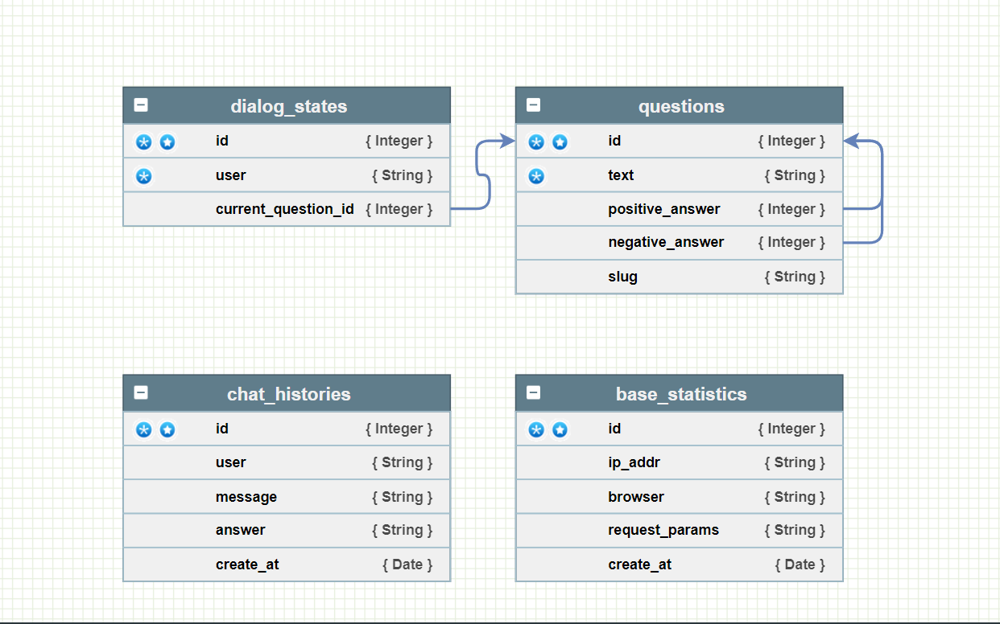

# EORA_bot


Тестовое задание для EORA.

Бот ассистент решает повседневную задачу большинства людей,
распознования кота от хлеба.


***


##### Панель администратора:
https://eora-bot.hopto.org/admin

- login: admin
- password: admin

##### Endpoint для общения с ботом
- https://eora-bot.hopto.org/api/message


***


## Перменные окружения

```
DB_ENGINE=
POSTGRES_DB=
POSTGRES_USER=
POSTGRES_PASSWORD=
DB_HOST=
DB_PORT=
APP_HOST=
DEBUG=
SECRET_KEY=
DJANGO_ADMIN_USERNAME=
DJANGO_ADMIN_PASSWORD=
```

## Быстрый старт
##### Описание как локально развернуть проект.


#### Linux:
```
git clone git@github.com:mnmyasis/EORA_bot.git
cd EORA_bot
pyhon3 -m venv venv
source venv/bin/activate
cd bot
pip install -r requirements.txt
```

```
python manage.py migrate
python manage.py test
python manage.py collectstatic --no-input
python manage.py loaddata --app app --format json data/questions.json
python manage.py initial_user
python manage.py runserver
```
#### Windows(PowerShell)
```
git clone git@github.com:mnmyasis/EORA_bot.git
cd EORA_bot
pyhon3.exe -m venv venv
.\venv\Scripts\activate
cd bot
pip install -r requirements.txt
```

```
python.exe manage.py migrate
python.exe manage.py test
python.exe manage.py collectstatic --no-input
python.exe manage.py loaddata --app app --format json data/questions.json
python.exe manage.py initial_user
python.exe manage.py runserver
```


***


## CI/CD
##### Описание настройки ci/cd
##### Переменные окружение github actions
```
DB_ENGINE=
POSTGRES_DB=
POSTGRES_USER=
POSTGRES_PASSWORD=
DB_HOST=
DB_PORT=
APP_HOST=
DEBUG=
SECRET_KEY=
DJANGO_ADMIN_USERNAME=
DJANGO_ADMIN_PASSWORD=
DOCKER_USERNAME=login dockerhub
DOCKER_PASSWORD=password dockerhub
HOST=ip address server
USER=login ssh
SSH_KEY=private key
TELEGRAM_TO=id telegram account
TELEGRAM_TOKEN=token telegram bot
```
## Подготовка сервера

- На сервере создать каталог `/home/<username>/eora_bot/`
```
mkdir /home/<username>/eora_bot
```

- Закинуть в каталог eora_bot `nginx.conf` и `docker-compose.yml`
```
scp infra/nginx.conf root@192.168.1.2:/home/<username>/eora_bot
scp infra/docker-compose.yml root@192.168.1.2:/home/<username>/eora_bot
```

- Установить certbot
```
sudo apt install snapd
sudo snap install core; sudo snap refresh core
sudo snap install --classic certbot
sudo ln -s /snap/bin/certbot /usr/bin/certbot 
```

- Сгенерировать ssl сертификат
```
sudo certbot --nginx 
```

##### На этом всё, вы великолепны!

***


## Документация API:
https://eora-bot.hopto.org/redoc/


## Примеры запросов

##### Запрос `POST`
```
/api/message
```
```
{
    "user_id": "qwewqeqweqweqw123123",
    "message": "/start"
}
```
##### Ответ
```
{
    "text": "Привет! Я помогу отличить кота от хлеба! Объект перед тобой квадратный?"
}
```


***


## Схема БД





# Технологии:
- Django
- DRF
- Postgresql
- Docker
- Github Actions
